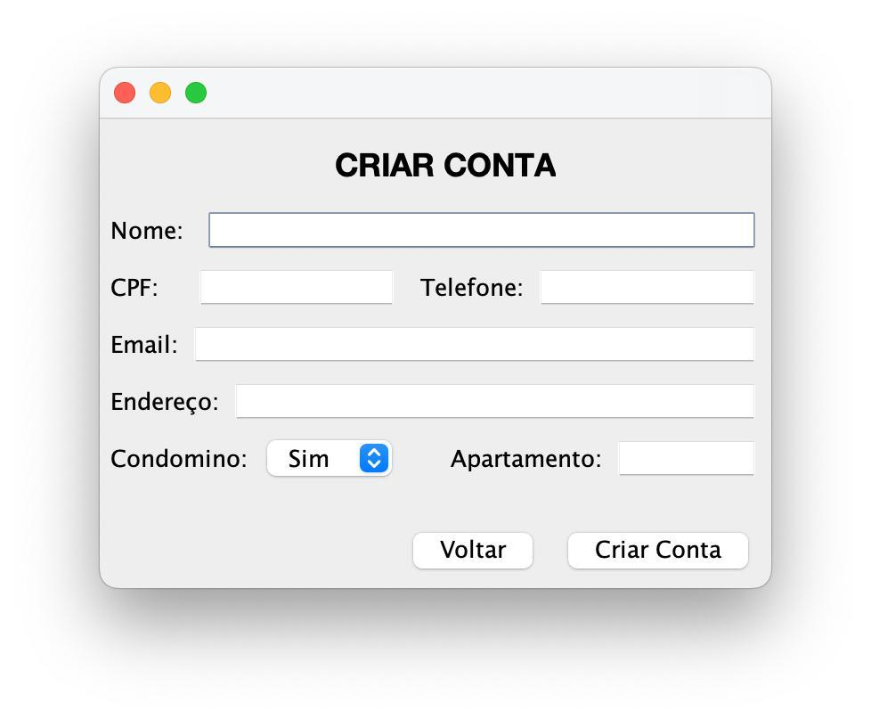
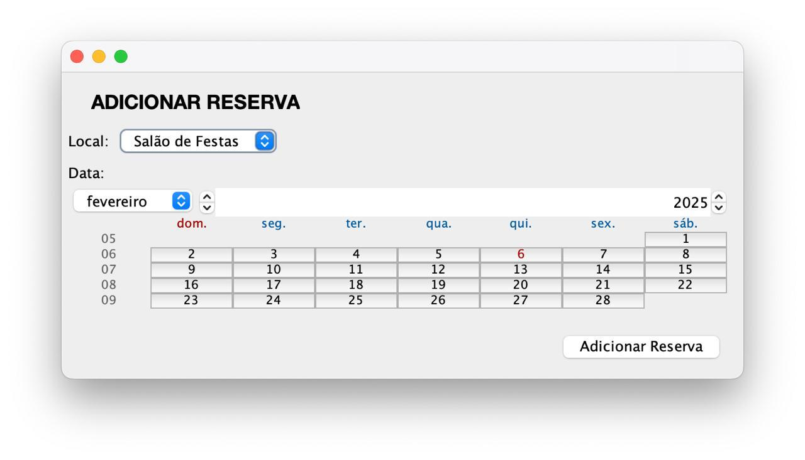
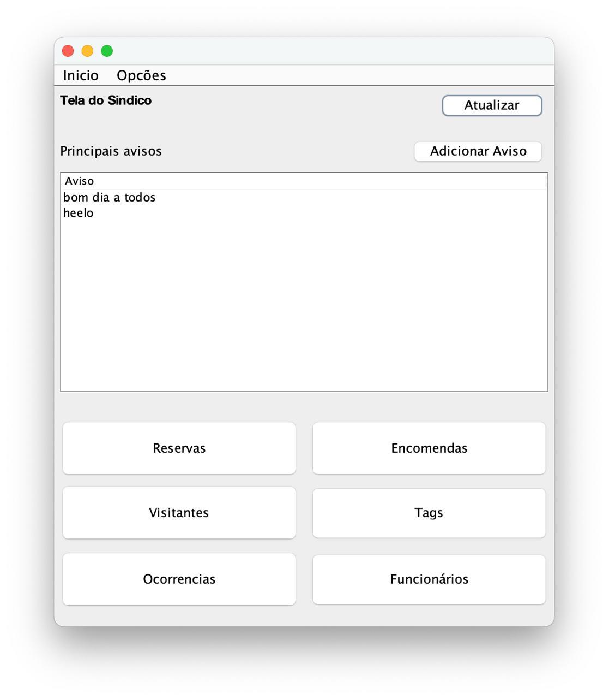
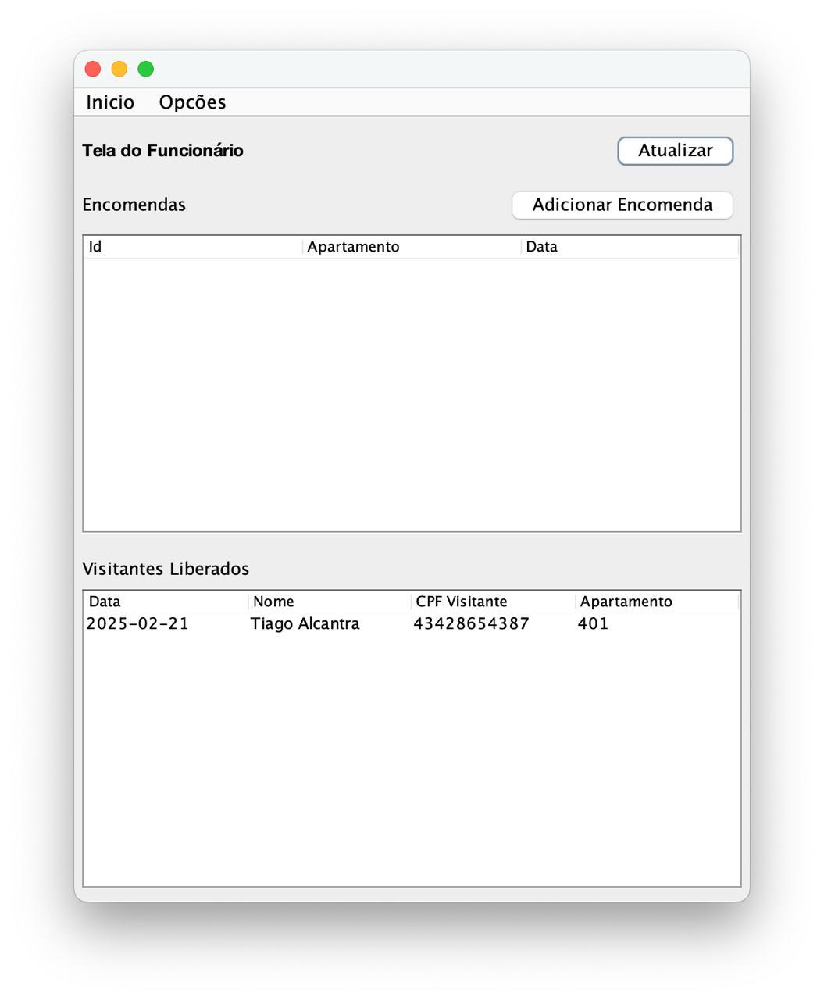

---

# SmartCondos 🏢

**Gerenciamento Inteligente de Condomínios**

O **SmartCondos** é um sistema desenvolvido para facilitar a administração de condomínios, melhorando a comunicação entre moradores, síndicos e funcionários. 
Ele centraliza informações importantes, eliminando métodos tradicionais como livros de ocorrências e registros manuais. 
O objetivo do sistema não é otimizar a eficiência administrativa e a organização do condomínio.

> ℹ️ Imagens do sistema em funcionamento com dados fictícios:

<p align="center">
  
  
</p>

<p align="center">
  
  
</p>

## 📌 Funcionalidades Principais
- Registro e gerenciamento de condôminos, visitantes e funcionários
- Controle de reservas de áreas comuns
- Administração de encomendas e entregas
- Comunicação eficiente através de avisos e ocorrências
- Controle de acesso via tags de visitantes
- Gestão do síndico e suas responsabilidades

## 🛠️ Tecnologias Utilizadas
- **Linguagem:** Java 
- **IDE:** NetBeans 🖥
- **Banco de Dados:** PostgreSQL 🗄
- **Arquitetura:** MVC com aplicação do princípio **DIP (Dependency Inversion Principle)**
- **Ferramenta CASE:** Astah UML 
- **Controle de Versão:** GitHub 

## 📂 Estrutura do Repositório
📁 `docs/` → Documentação do projeto (diagramas de classe, caso de uso, requisitos)  
📁 `src/` → Código-fonte do sistema SmartCondos  
📁 `database/` → Arquivos do banco de dados 
📁 `assets/` → Recursos visuais e ícones do sistema

## 📖 Documentação - Links
🔹 [Guia de Instalação e Configuração](docs/installation.md)  
🔹 [Diagramas UML (Casos de Uso e Classes) e Requisitos do Sistema](docs/readme.md)  
🔹 [Banco de Dados (Modelo e Scripts)](database/readme.md) 

## 🚀 Como Executar o Projeto
1. Clone o repositório:  
   ```bash
   git clone https://github.com/MatheusMadureiraa/JavaAndPostgreSQL-POO-SmartCondos.git
   ```
2. Configure o banco de dados PostgreSQL utilizando o script `smartcondos.sql`
3. Abra o projeto no NetBeans
4. Compile e execute o sistema 🚀

## 👥 Equipe Responsável
- **[Matheus Madureira](https://github.com/MatheusMadureiraa)**
- **Alisson Carvalho**
- **[João Pedro](https://github.com/jotasoftware)**

Projeto desenvolvido com ❤️ para otimizar a gestão de condomínios!
